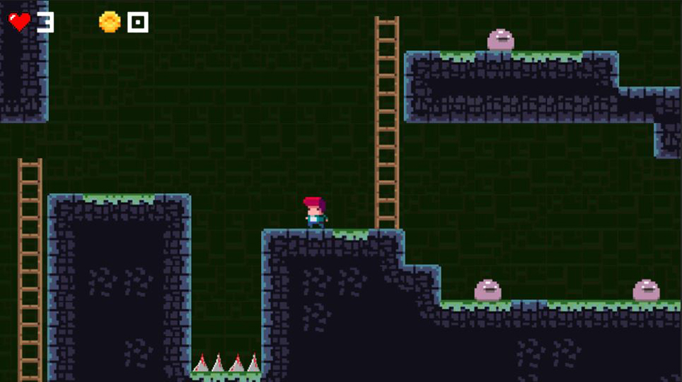

# TileVania
Projeto pessoal de um jogo de plataforma para estudar alguns recursos da Unity:
* Tilemap para criar o cenário
* Unity Rule Tiles
* Cinemachine deixando a câmera com movimento dinâmico.

# Game
**Jogue agora em** https://geisonleite.itch.io/tilevania

# Screenshots

  

    <b>Level 1</b> 
    
  

  

    <b>Level 2</b> 
    
  

  

    <b>Level 3</b> 
    
  

